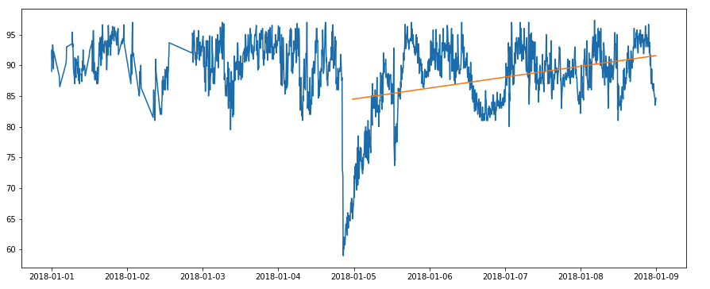
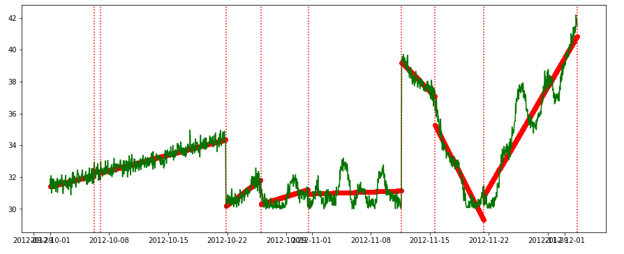
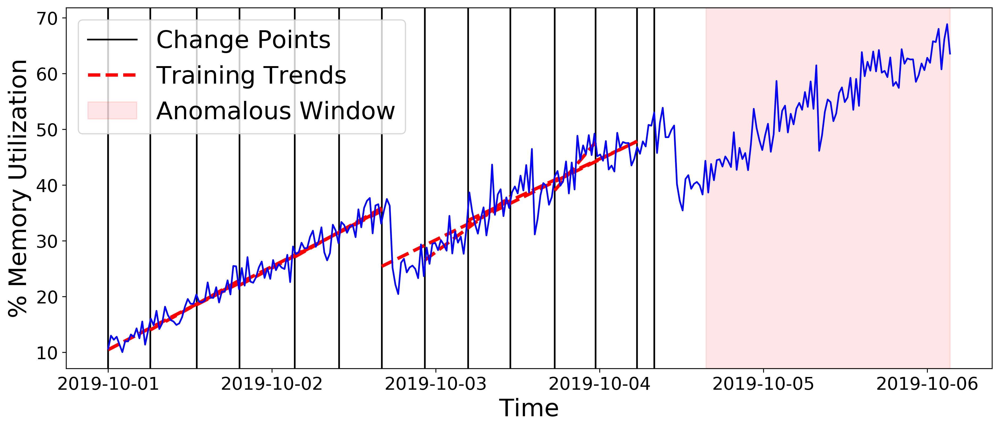
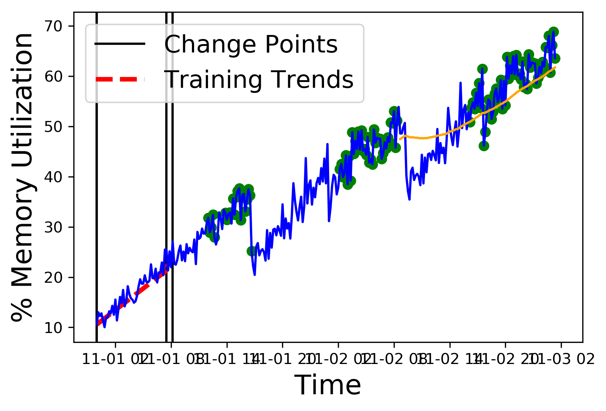

## Memory Leak Detection Using Trend Analysis

A memory leak in an application deployed on the cloud can affect the availability and reliability of the application. 
Therefore, to identify and ultimately resolve it quickly is highly important. 
However,  in the production environment running on the cloud, memory leak detection 
is a challenge without the knowledge of the application or its internal object allocation details. 


For solving the challenge of online detection of memory leaks in cloud-based infrastructure 
without having any internal application knowledge we introduce multiple algorithms. 
 The main introduced algorithm is Precog (which works based on ML and uses history information)
 This algorithms solely use one metric i.e the system's memory utilization on 
 which the application is deployed for the detection of a memory leak. In this work there are 5 algorithms introduced: 
 
 1. Simple memory leak detection based on Linear Backward Regression.
 2. Based on Polynomial Linear Fitting.
 3. Based on Using Change Points
 4. Precog
 5. Precog Online Version
 


Read More in our paper: https://link.springer.com/chapter/10.1007/978-3-030-76352-7_21
For other algorithms: https://arxiv.org/abs/2106.08938

Architecture of Precog: 
<p align="center">
</img>
</p> 

# Usecase Example
 ```
import sys
sys.path.append('../')
import pandas as pd
from mem_leak_detection import MemLeakDetectionAlgorithm
from mem_leak_detection import MemLeakDetectionAlgorithmPolyFit # based on the linear polynomial fittting on the window
from mem_leak_detection import MemLeakDetectionAlgorithmChangePoints # based on the change point detection
from mem_leak_detection import Precog # introduced Precog algorithm
from mem_leak_detection import PrecogOnline # introduced online version of Precog algorithm

## Get the dataset 
dataset = pd.read_csv('m_1935.csv', names=['timestamp', 'machine_id', 'mem_util_percent', 'label'], skiprows = 1)
dataset['timestamp'] =  pd.to_datetime(dataset['timestamp'])
dataset.set_index('timestamp', inplace=True)

# Run the algorithm
p1 = MemLeakDetectionAlgorithm() # or MemLeakDetectionAlgorithmPolyFit()  # or MemLeakDetectionAlgorithmChangePoints() 
p1 = p1.fit(dataset.mem_util_percent)
p1.predict(dataset.mem_util_percent)
 ```
 
 Check [Example Python Notebook](./example/memory_leak_detection_algo%20(example1).ipynb) for more usage details. 
 
 Example of Memory leak Detection using linear Polynomial Fitting : 
 
 
 
 
  Example of Memory leak Detection using Change points : 
 
 
 
   Example of Memory leak Detection using Precog : 
 
 
 
    Example of Memory leak Detection using Precog Onnline : 
 
 

# Testing the algorithms
(do check the base path in test.py)
For testing all the algorithms :
 ```
    python3 test.py
  ```

# Results 
### [Time 22.08.2019, 12:10], r2 : 0.8
<pre>
Algorithm:  Backward_Propagation F1-Score:  0.5681818181818182 Time Taken:  97.964118172 TP :  25 FP :  38 TN :  7 FN :  0 TTP :  25 TTN :  45
Algorithm:  Polynomial_Fitting F1-Score:  0.5783132530120482 Time Taken:  92.99911340699998 TP :  24 FP :  34 TN :  11 FN :  1 TTP :  25 TTN :  45
Algorithm:  Change_Points F1-Score:  0.625 Time Taken:  23.922472314999993 TP :  25 FP :  30 TN :  15 FN :  0 TTP :  25 TTN :  45
Algorithm:  PrecogChangePoints_Training_Test_Same F1-Score:  0.6296296296296295 Time Taken:  25.531905480999995 TP :  17 FP :  12 TN :  33 FN :  8 TTP :  25 TTN :  45
Algorithm:  PrecogChangePoints_Training_Test_Same with Max Filtration F1-Score:  0.2758620689655173 Time Taken:  25.482877984999988 TP :  4 FP :  0 TN :  45 FN :  21 TTP :  25 TTN :  45
Algorithm:  Precog_Change_Points F1-Score:  0.6666666666666665 Time Taken:  19.508522030999984 TP :  15 FP :  10 TN :  30 FN :  5 TTP :  20 TTN :  40
Algorithm:  Precog_Change_Points_Max Filtration F1-Score:  0.8571428571428571 Time Taken:  19.517760752000015 TP :  15 FP :  0 TN :  40 FN :  5 TTP :  20 TTN :  40
</pre>


## Reference Our paper:

If you find this code useful in your research, please consider citing:

```
@InProceedings{10.1007/978-3-030-76352-7_21,
author="Jindal, Anshul
and Staab, Paul
and Cardoso, Jorge
and Gerndt, Michael
and Podolskiy, Vladimir",
editor="Hacid, Hakim
and Outay, Fatma
and Paik, Hye-young
and Alloum, Amira
and Petrocchi, Marinella
and Bouadjenek, Mohamed Reda
and Beheshti, Amin
and Liu, Xumin
and Maaradji, Abderrahmane",
title="Online Memory Leak Detection in the Cloud-Based Infrastructures",
booktitle="Service-Oriented Computing  -- ICSOC 2020 Workshops",
year="2021",
publisher="Springer International Publishing",
address="Cham",
pages="188--200",
abstract="A memory leak in an application deployed on the cloud can affect the availability and reliability of the application. Therefore, to identify and ultimately resolve it quickly is highly important. However, in the production environment running on the cloud, memory leak detection is a challenge without the knowledge of the application or its internal object allocation details.",
isbn="978-3-030-76352-7"
}

@misc{jindal2021memory,
      title={Memory Leak Detection Algorithms in the Cloud-based Infrastructure}, 
      author={Anshul Jindal and Paul Staab and Pooja Kulkarni and Jorge Cardoso and Michael Gerndt and Vladimir Podolskiy},
      year={2021},
      eprint={2106.08938},
      archivePrefix={arXiv},
      primaryClass={cs.DC}
}
```

## Help and Contribution

Please add issues if you have a question or found a problem. 

Pull requests are welcome too!

Contributions are most welcome. Please message me if you like the idea and want to contribute. 
